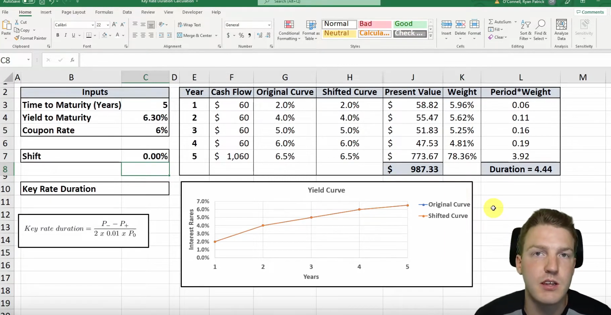

# Key Rate Duration - Ryan O'Connell

Yield to maturity - total return if bond is held to maturity

Yield curve - plots the interest rate/YTM of x-year bonds (rate for 1-year bond, 2-year bond, etc.)

Weight_t = proportion of present value in year t out of the total present value

Period = year t

**Macaulay duration** is sum of all the weighted periods

- Macaulay duration 4.44 means value of the bond will fall by 4.44% if the yield curve shifts up by 1%. If the yield curve shifts down by 1% the value of the bond with increase by 4.44%.

shift

**Key rate duration for a specific interest rate** = (P- - P+)/2 x ∆r

Where:

P- is the bond price when the key interest rate decreases by a small amount (∆r)

P+ is the bond price when the key interest rate increases by the same small amount (∆r)

∆r is the change in the key interest rate

In other words, it's the **slope of the yield curve at a specific interest rate/maturity**

It measures the sensitivity of the bond price to changes in interest rates at specific points on the yield curve.