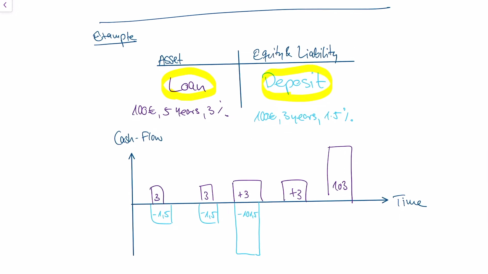

**Equity** represents the amount of money that would be returned to shareholders if all of the company’s assets were liquidated and all of its debts were paid off

Equity = Assets - Liabilities

### Risk Types

Credit risk - risk that people don't pay back loans

Market risk - currency risk (value of different currencies change), equity risk (values of invested stocks change)

Operational risk - things go wrong during e.g. a transfer

## Basel 3

- Calculates the 99.9% worst case scenario of the year
- Pillar 1 (Regulatory approach)
  - Regulations define the largest amount of risk banks can take on
  - e.g. equity*0.8% > risk pillar calculated by summing together all potential losses from all types of risk, weighted by risk of defaults
- Pillar 2 (economic approach)
  - Flexible, bank chooses its own risk types
  - Tailored to individual business model of the bank, can be a more accurate assessment

### Credit Risk

Pillar 1 approach

- **Exposure** = volume of credit

- Risk Weighted Assets = Exposure x Risk Weights

Pillar 2 approach

- Simulation of scenarios

### Market Risk

**Market parameters**

- Equity prices - price of shares of APPL
- Credit spreads - 
- Interest rates - Federal interest rates
- Exchange rates - USD/CAD, EUR/CAD
- Commodity Prices - Oil, gold

**Trading Book vs Banking book**

We need to make a distinction between assets that are held for a short term (these go in the trading book) and assets held for long term (banking book) because of short term changes in market parameters such as interest rates. Interest rate changes do not matter as much for assets in the banking book.

Pillar 1 focuses on income statement, short term

RWA calculated using formula given by regulators which tells us how much equity we need to cover the risk

Pillar 2 - everything in Pillar 1 but interest rate risk in the banking book (IRRBB) is also taken into consideration

### IRRBB (Interest Rate Risk in the Banking Book)

Pillar 2 in market risk management

Tries to assess what different/changing interest rates mean for assets in the banking book

Present value perspective - value of your portfolio right now (at present)

NII (Net Interest Income/net operating income) perspective - looks at cash flows in time

**Example**

Suppose central bank sets interest rate at 0%

Then EV of loan = 3 + 3 + 3 + 3 + 103

EV of deposit = -1.5 - 1.5 - 101.5

Summing EV of loan and deposit we get +10.5 which is great

NII perspective. Compare cash flows in/out each year and make sure they match up. We have a problem in year 3 where loan cash flow is +3 but deposit cash flow is -101.5. Bank could get some kind of credit in year 3 to offset the negative cash flow and pay it down in the following years. 

### Liquidity Risk

CEO needs to pay the janitor now but he forgot his wallet. There's a Picasso painting on the wall. He has the money, but it's illiquid.

Why did Silicon Valley Bank fail?

- Most of their assets are in the banking book, they are not liquid
- Deposits mostly from technology startups
- Rising interest rates make these startups withdraw their deposits, draining the bank's liquid reserves and forcing them to sell off bonds in the banking book at a loss because of the higher interest rates
- This wiped out all their equity
- People start realizing Silicon Valley bank is failing and everyone withdraws their deposits
- Bank go bust
- Failed to pay attention to present value of their portfolio and manage interest rate risk